# Projeto Indústria 4.0 — Pipeline de Dados Azure

> Documento de trabalho em progresso. Este arquivo vai sendo atualizado conforme novas seções (real-time, API, infraestrutura) são capturadas e documentadas.

## Visão geral da arquitetura

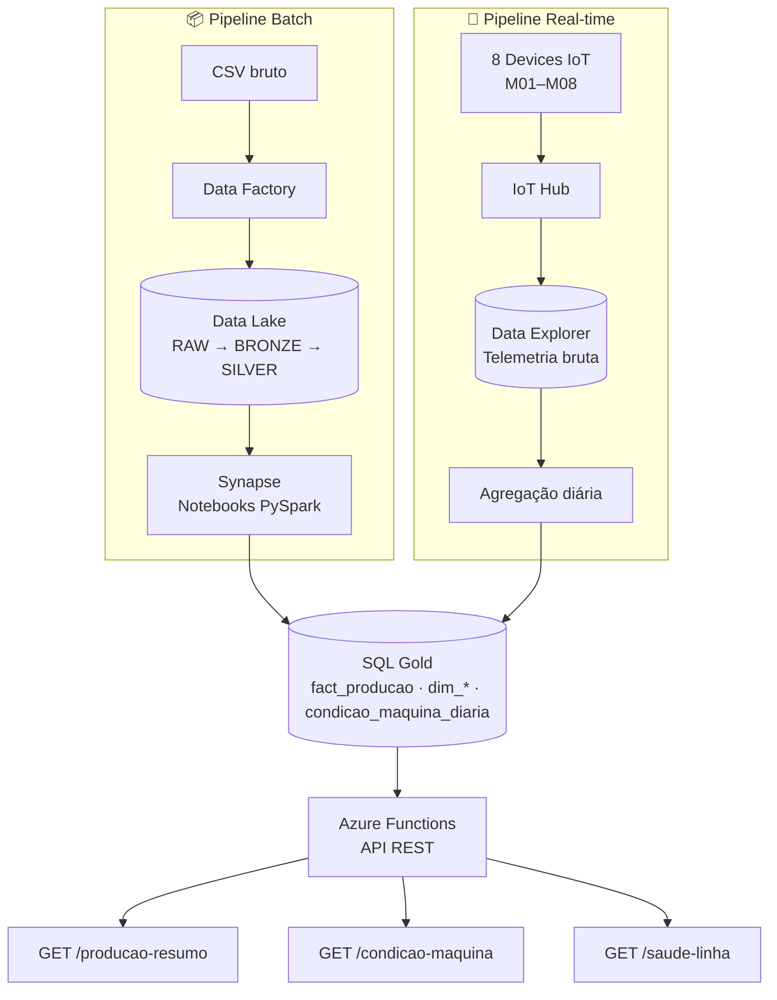

---

## Pipeline Batch: Raw → Bronze → Silver → Gold

O pipeline batch é responsável por ingerir dados históricos de produção (CSV) e transformá-los progressivamente até chegar num modelo dimensional pronto para consulta, seguindo a arquitetura medallion.

### Orquestração (Azure Data Factory)

O pipeline `pl_raw_to_bronze` copia os arquivos brutos para a camada Raw do Data Lake e dispara a primeira transformação. Abaixo, o histórico de execuções mostrando processamento bem-sucedido de ponta a ponta:

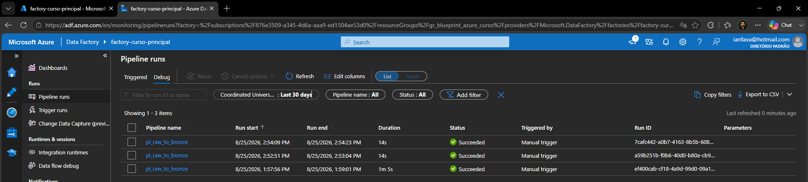

Além do Data Factory, o próprio Synapse orquestra um pipeline interno (`pipeline_batch_industry_4_0`) que encadeia visualmente cada etapa da transformação — leitura, metadados, processamento por linha (ForEach), e carga final via stored procedure:

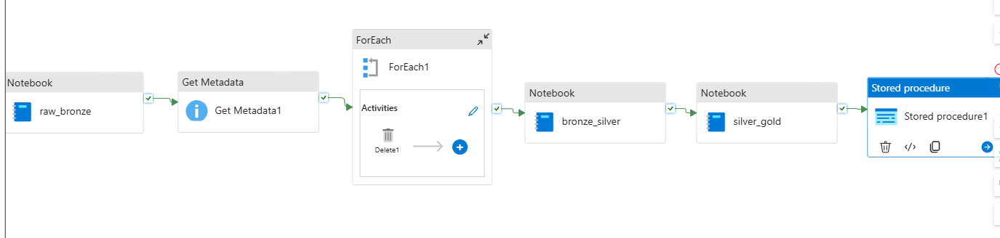

### Armazenamento em camadas (Azure Data Lake Storage)

Os dados são organizados fisicamente em três camadas dentro do container `inicial-datalake`, cada uma representando um estágio de maturidade dos dados:

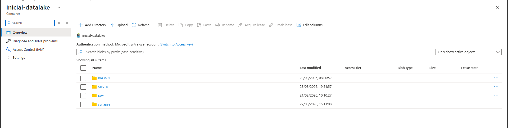

### Transformação e modelagem dimensional (Azure Synapse Analytics)

A transformação final ocorre em notebooks PySpark no Synapse, organizados em três etapas sequenciais (`01_raw_to_bronze`, `02_bronze_to_silver`, `03_silver_to_gold`). A última etapa lê os dados validados da camada Silver:

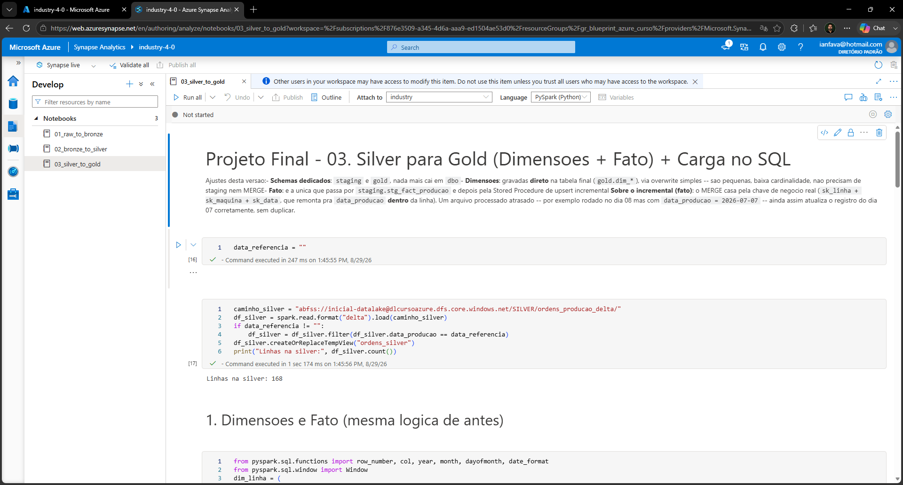

...e constrói o modelo final em Gold: dimensões carregadas via overwrite simples (baixa cardinalidade) e a tabela fato `gold.fact_producao` atualizada via upsert incremental, usando a chave de negócio (`sk_linha + sk_maquina + sk_data`) para garantir que reprocessamentos atrasados não dupliquem registros:

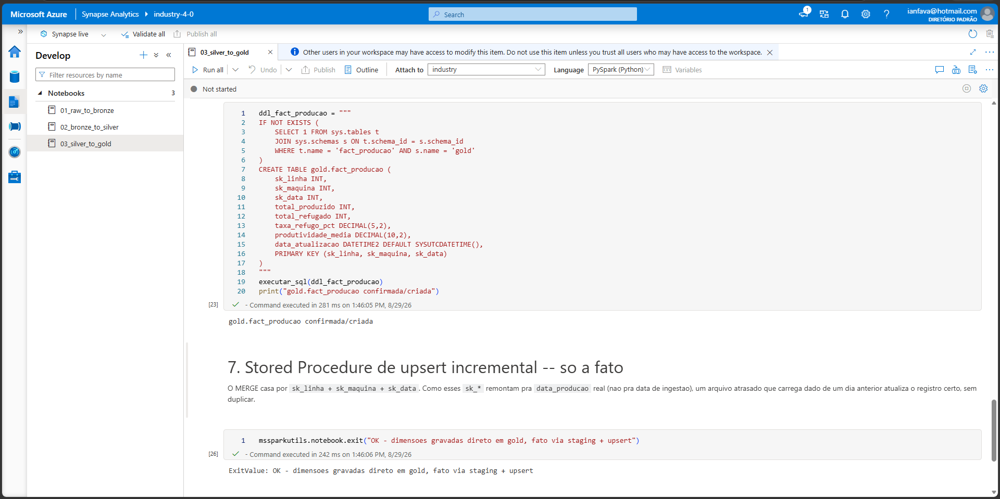

### Resultado final consultável (Azure SQL Database)

Os dados transformados ficam disponíveis para consumo (dashboards, APIs) na tabela `gold.fact_producao`, com métricas de produção já calculadas:

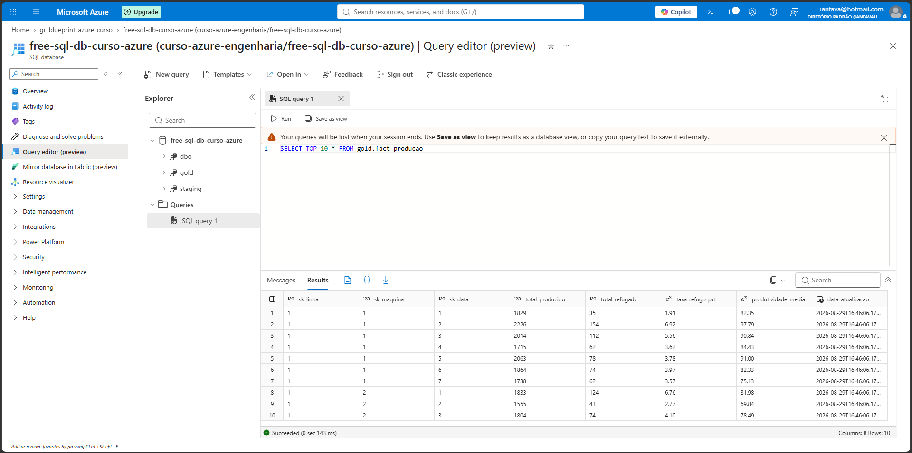

---

## Pipeline Real-time: IoT Hub → Data Explorer → SQL

O pipeline real-time captura telemetria simulada de sensores das máquinas da fábrica, ingere via IoT Hub, armazena em série temporal no Azure Data Explorer, e agrega diariamente para consumo no SQL Gold.

### Dispositivos IoT

8 devices simulando máquinas da fábrica (M01–M03 → Linha 1, M04–M06 → Linha 2, M07–M08 → Linha 3), registrados e habilitados no IoT Hub:

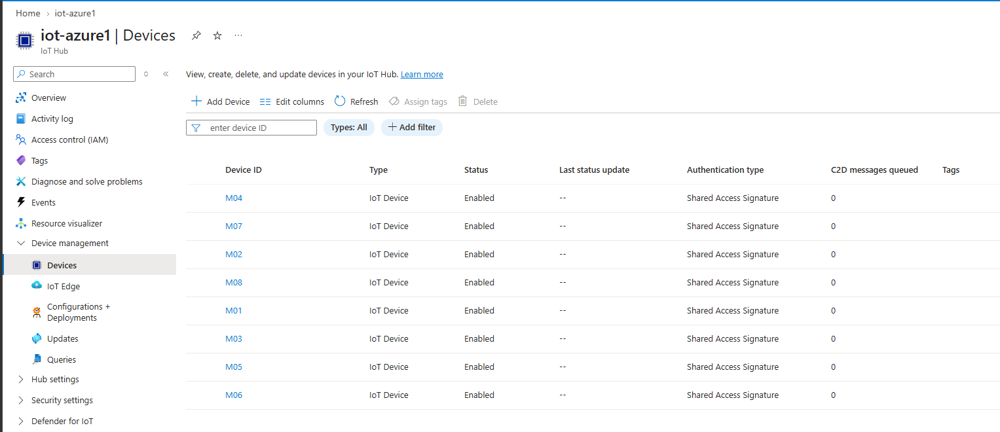

### Telemetria bruta no Data Explorer (Azure Data Explorer / Kusto)

Os dados de sensor (temperatura, vibração, RPM) chegam na tabela `TelemetriaMaquinas`, com granularidade de série temporal (`id_maquina`, `linha_producao`, `timestamp`):

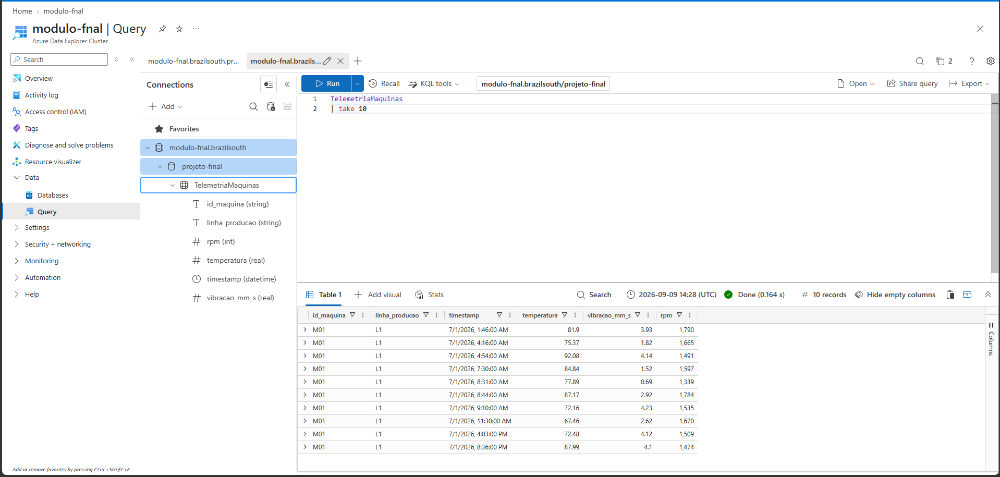

> Nota operacional: o cluster Data Explorer cobra por tempo de compute mesmo ocioso, então fica parado (Stopped) por padrão e só é ligado sob demanda para ingestão/consulta — lição aprendida após um incidente de custo (ver seção "Decisões técnicas e lições aprendidas").

### Agregação diária consultável (Azure SQL Database)

A telemetria bruta é agregada diariamente por máquina e disponibilizada na tabela `gold.condicao_maquina_diaria`, com médias de temperatura, vibração e RPM prontas para consumo:

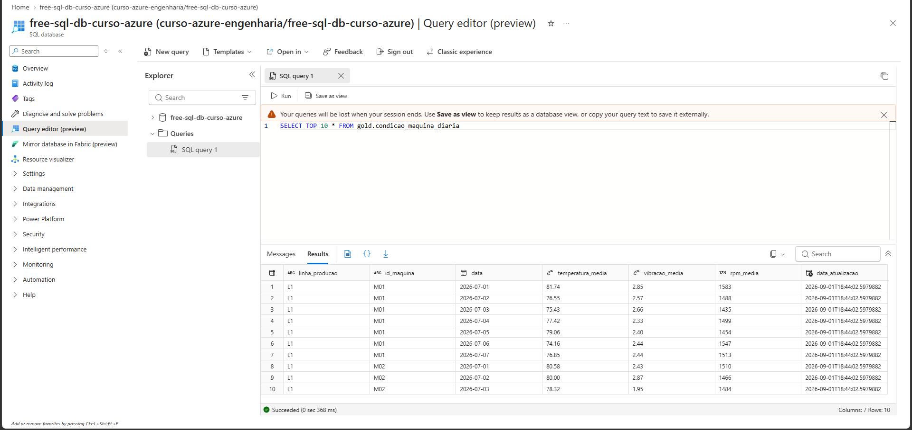

---

## API: Azure Functions

A camada de exposição de dados do projeto é uma Azure Function App (`blueprint-azure`, plano Flex Consumption, Linux, Python 3.13) com 3 rotas HTTP que consultam o SQL Gold gerado pelo pipeline Synapse:

- `GET /api/producao-resumo?linha=L1` — resumo de produção por linha, com detalhe por dia e máquina
- `GET /api/condicao-maquina?id_maquina=M01` — última leitura de condição (temperatura, vibração, rpm) de uma máquina
- `GET /api/saude-linha?linha=L1` — visão combinada de produção + condição das máquinas de uma linha

Autenticação via credencial de função (`AuthLevel.FUNCTION`) e conexão ao SQL via `pymssql`, escolhido por não depender de driver de sistema operacional — funciona direto no Linux Consumption plan sem configuração extra. Credenciais do banco nunca ficam em texto plano no código: são lidas de variáveis de ambiente (Application Settings), com o padrão do código já preparado para receber uma referência direta ao Key Vault (`@Microsoft.KeyVault(SecretUri=...)`) caso a rotação de segredo seja aplicada aqui no futuro.

### Bloqueio inicial e resolução

Durante a criação da Function App, o portal Azure não exibia mais a opção clássica de plano Consumption (Linux) como card visual — apenas "Flex Consumption" (não suportado em conta Free Trial) e "Consumption (Windows)" (sem suporte a runtime Python). Após diagnóstico com `az functionapp create --debug`, foi identificado que o erro de rede (`ConnectionResetError`) ocorria numa chamada específica (`functionAppStacks`) que baixa um catálogo grande, provavelmente por limitação de rede local.

A resolução definitiva veio do upgrade da assinatura de Free Trial para Pay-As-You-Go (mantendo o crédito promocional intacto até a data de expiração original) — isso removeu a restrição de "Flex Consumption não suportado em conta trial", permitindo criar a Function App pelo fluxo padrão do portal.

### Deploy: do código local à nuvem

O plano original era publicar via extensão Azure Functions do VS Code, seguindo o mesmo fluxo do curso. Dois obstáculos técnicos precisaram ser resolvidos antes do primeiro deploy bem-sucedido:

1. A extensão do VS Code apresentou erro persistente ao listar assinaturas disponíveis (`select a subscription` vazio) — resolvido ao autenticar a conta diretamente dentro da extensão (painel lateral **Azure → Resources → Sign in to Tenant**), um login independente do `az login` do terminal.
2. O login do Azure CLI travava silenciosamente (janela de seleção de conta fechava sem completar) — causa identificada como bug conhecido do broker WAM do Windows, resolvido com `az config set core.enable_broker_on_windows=false`.

Com o login da extensão resolvido, o primeiro deploy foi concluído tecnicamente com sucesso — mas publicando o **projeto errado**.

### Troubleshooting: deploy publicando o projeto errado

O workspace local chegou a ter duas pastas de function app: `api_projeto_final` (o código real, com as 3 rotas) e `api_function_project` (um projeto de exemplo criado ao seguir uma aula do curso, com uma rota HTTP genérica de "Hello, {name}"). Mesmo com `api_projeto_final` corretamente marcado como projeto padrão do workspace na extensão, o comando **"Deploy to Azure"** publicava repetidamente o projeto de exemplo:

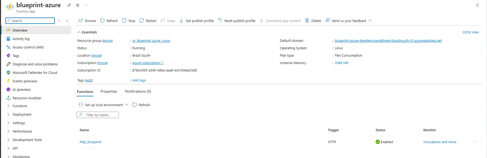

A causa raiz estava em `.vscode/settings.json`: a extensão usa duas chaves de configuração distintas — `projectSubpath` (qual pasta é reconhecida como o projeto do workspace) e `deploySubpath` (qual pasta é efetivamente publicada no deploy). A primeira estava correta; a segunda tinha ficado presa no valor da pasta de exemplo desde a criação inicial da function app pela extensão, e nunca foi atualizada:

```jsonc
// antes
"azureFunctions.deploySubpath": "api_function_project",
"azureFunctions.projectSubpath": "api_projeto_final"

// depois
"azureFunctions.deploySubpath": "api_projeto_final",
"azureFunctions.projectSubpath": "api_projeto_final"
```

Corrigido o `deploySubpath` — e removida a pasta de exemplo do repositório, já sem uso —, o deploy passou a publicar o código certo, confirmado pelas 3 rotas reais aparecendo na Function App:

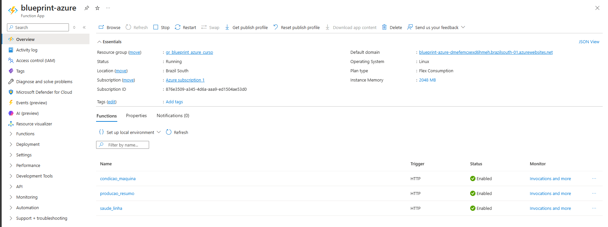

### Troubleshooting: erro 500 por variáveis de ambiente ausentes na nuvem

Com o código certo publicado, as 3 rotas retornavam erro 500. O `local.settings.json` (usado só em testes locais, nunca enviado no deploy por estar no `.gitignore`) tinha as credenciais do SQL corretas, mas a Function App na nuvem não tinha nenhuma variável de ambiente própria da aplicação cadastrada — só as de infraestrutura criadas automaticamente pelo Azure (Application Insights, Storage).

Como `SQL_USER` e `SQL_PASSWORD` não têm valor padrão no código (diferente de `SQL_SERVER` e `SQL_DATABASE`, que têm), a função tentava conectar ao SQL Server com usuário e senha vazios, falhando com 500 em qualquer uma das 3 rotas. Resolvido cadastrando as variáveis em **Function App → Settings → Environment variables**, com os mesmos valores usados localmente.

### Resultado: as 3 rotas respondendo com dado real

**`condicao-maquina?id_maquina=M01`**

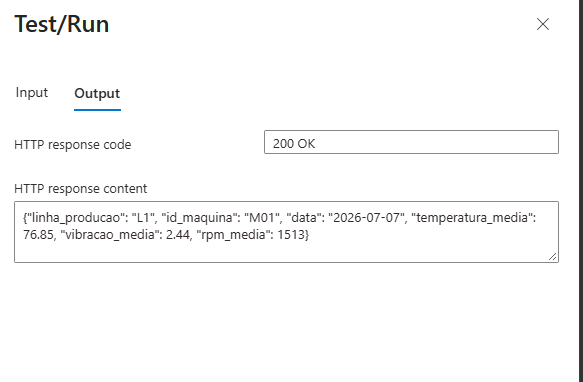

**`producao-resumo?linha=L1`**

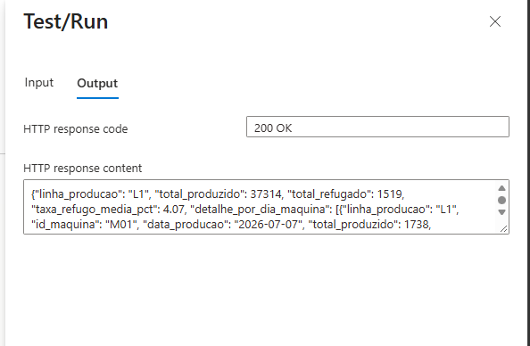

**`saude-linha?linha=L2`**

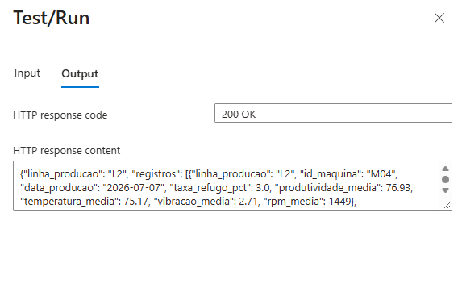

Os testes acima foram feitos pelo painel **Code + Test → Test/Run** do próprio portal Azure, que autentica com a host key da função automaticamente — uma forma prática de validar o endpoint sem expor a URL pública (que carrega a chave de acesso na query string) em capturas de tela.

### Status atual

- ✅ Function App criada e rodando na nuvem (plano Flex Consumption, runtime Python 3.13, Linux)
- ✅ Código com as 3 rotas HTTP (`producao-resumo`, `condicao-maquina`, `saude-linha`), credenciais via variável de ambiente (nunca hardcoded, com referência preparada para Key Vault)
- ✅ Deploy publicado corretamente via extensão Azure Functions do VS Code, após correção do `deploySubpath`
- ✅ Variáveis de ambiente (`SQL_USER`, `SQL_PASSWORD`) cadastradas nas Application Settings da Function App
- ✅ As 3 rotas testadas na nuvem e respondendo com dados reais do SQL Gold, incluindo join entre produção e condição de máquina na rota combinada

---

## Infraestrutura como Código: Terraform

Módulo bônus do curso, demonstrando provisionamento de infraestrutura Azure via código em vez de clique manual no Portal. O objetivo: recriar, via Terraform, dois recursos que já existem no projeto e foram criados manualmente ao longo do curso — um Storage Account com hierarquia habilitada (Data Lake Gen2) e um Key Vault — provando o mesmo padrão de forma reprodutível e versionável.

O Resource Group usado (`gr_blueprint_azure_curso`) já existe e já contém todos os outros recursos do projeto; o Terraform apenas o **referencia** (bloco `data`, não `resource`), lendo suas informações sem criar, alterar ou gerenciar o grupo em si — os recursos novos (Storage Account, Container, Key Vault, Access Policy) são criados ao lado, sem interferir no que já está lá.

### Código (`main.tf`)

```hcl
terraform {
  required_providers {
    azurerm = {
      source  = "hashicorp/azurerm"
      version = "~> 3.0"
    }
  }
}

provider "azurerm" {
  features {}
  skip_provider_registration = true
}

# Resource Group: ja existe, so referenciamos
data "azurerm_resource_group" "meu_rg" {
  name = "gr_blueprint_azure_curso"
}

# Precisamos do tenant/subscription atual pro Key Vault
data "azurerm_client_config" "atual" {}

# ---------- Data Lake (Storage Account Gen2 + Container) ----------
resource "azurerm_storage_account" "datalake" {
  name                     = "dltfianfava01"
  resource_group_name      = data.azurerm_resource_group.meu_rg.name
  location                 = data.azurerm_resource_group.meu_rg.location
  account_tier             = "Standard"
  account_replication_type = "LRS"
  is_hns_enabled           = true  # transforma o Storage Account em Data Lake Gen2
}

resource "azurerm_storage_container" "raw" {
  name                  = "raw"
  storage_account_name  = azurerm_storage_account.datalake.name
  container_access_type = "private"
}

# ---------- Key Vault ----------
resource "azurerm_key_vault" "kv" {
  name                = "kv-tf-ianfava01"
  resource_group_name = data.azurerm_resource_group.meu_rg.name
  location            = data.azurerm_resource_group.meu_rg.location
  tenant_id           = data.azurerm_client_config.atual.tenant_id
  sku_name            = "standard"
}

resource "azurerm_key_vault_access_policy" "minha_conta" {
  key_vault_id       = azurerm_key_vault.kv.id
  tenant_id          = data.azurerm_client_config.atual.tenant_id
  object_id          = data.azurerm_client_config.atual.object_id
  secret_permissions = ["Get", "List", "Set", "Delete"]
}

# ---------- Outputs ----------
output "storage_account_name" {
  value = azurerm_storage_account.datalake.name
}

output "datalake_primary_endpoint" {
  value = azurerm_storage_account.datalake.primary_dfs_endpoint
}

output "key_vault_uri" {
  value = azurerm_key_vault.kv.vault_uri
}
```

### Troubleshooting: registro automático de Resource Providers travando em rede

Ao rodar `terraform plan` pela primeira vez, o comando parecia travado — na verdade, o provider `azurerm` estava tentando registrar automaticamente **todos** os Resource Providers que ele suporta na assinatura (dezenas deles: `Microsoft.EventHub`, `Microsoft.ContainerInstance`, `Microsoft.CognitiveServices`, entre outros que o projeto nem usa), e várias dessas chamadas de rede falhavam com `connection may have been reset`.

Como os providers realmente necessários (`Microsoft.Storage`, `Microsoft.KeyVault`) já estavam registrados na assinatura — usados há semanas pelo resto do projeto —, a correção foi desativar esse registro automático desnecessário, adicionando `skip_provider_registration = true` ao bloco `provider "azurerm"` (nome do parâmetro específico da versão 3.x do provider; a partir da versão 4.x o equivalente passa a se chamar `resource_provider_registrations`).

### Troubleshooting: instabilidade de rede em IPv6

Mesmo após a correção acima, `terraform apply` seguiu falhando de forma intermitente em chamadas específicas (leitura do Resource Group, `listKeys` do Storage Account, leitura do Key Vault), sempre com o mesmo padrão: a chamada ficava "pendurada" por vários minutos e então falhava com erro de conexão resetada pelo host remoto. Inspecionando a mensagem de erro, os endereços envolvidos eram IPv6 — um padrão de instabilidade já observado antes neste projeto em outras chamadas de rede longas (deploy da Function App, registro de providers).

A correção foi desativar o protocolo IPv6 no adaptador de rede (Configurações → Rede e Internet → Configurações avançadas de rede → propriedades do adaptador Wi-Fi → desmarcar "Protocolo IP Versão 6 (TCP/IPv6)"), forçando as conexões por IPv4. Após essa mudança, `terraform apply` completou sem nenhuma outra falha de rede.

Como consequência das tentativas anteriores, o Terraform detectou que o Storage Account criado numa tentativa falha estava em estado inconsistente ("tainted") e o recriou automaticamente na aplicação seguinte — comportamento correto e esperado da ferramenta: nunca deixar um recurso em estado parcial, preferindo destruir e recriar a arriscar inconsistência.

### Execução: plan → apply → confirmação → destroy

**`terraform plan`** — pré-visualização das 4 ações antes de qualquer criação real:

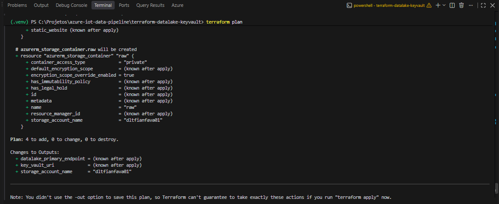

**`terraform apply`** — criação efetiva dos recursos, confirmada pelos 3 outputs:

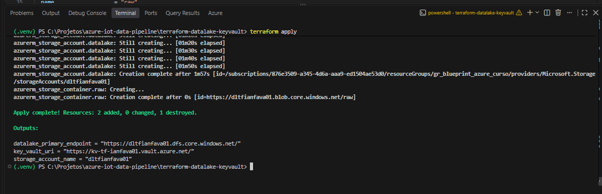

**Confirmação no Portal Azure** — Storage Account (`dltfianfava01`) e Key Vault (`kv-tf-ianfava01`) criados dentro do Resource Group já existente, ao lado dos demais recursos do projeto, sem interferência:

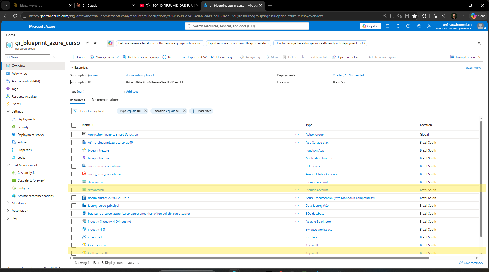

**`terraform destroy`** — encerramento do exercício, removendo os 4 recursos criados sem tocar no Resource Group (que foi apenas referenciado, nunca gerenciado pelo Terraform):

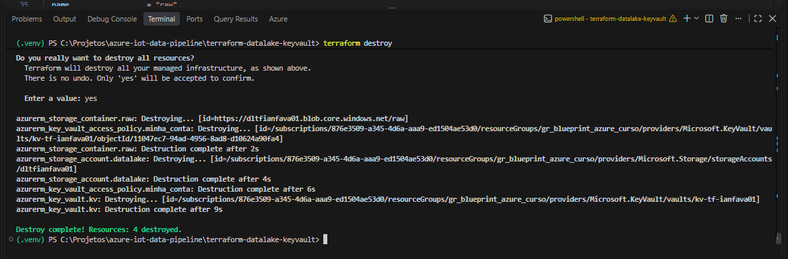

### Status atual

- ✅ Módulo Terraform completo: Storage Account (Data Lake Gen2) + Container + Key Vault + Access Policy provisionados via código
- ✅ Ciclo de vida completo testado: `init` → `plan` → `apply` → confirmação visual no Portal → `destroy`
- ✅ Dois problemas de rede diagnosticados e documentados (registro automático de providers; instabilidade em IPv6)
- ⬜ Docker e CI/CD (GitHub Actions): planejados como próximos módulos bônus

---

## Decisões técnicas e lições aprendidas

- Separação de responsabilidades: Storage Account dedicado (`stfuncindustria40`) para a Function App, separado do Data Lake principal (`dlcursoazure`)
- Segurança: uso de variáveis de ambiente / `.env` para todas as credenciais (nunca hardcoded), após incidente de exposição acidental
- Custo: incidente de ~R$170 causado pelo cluster Azure Data Explorer permanecendo em estado "Running" sem uso ativo — lição aprendida sobre monitoramento ativo de recursos de compute

### Credenciais do SQL nos notebooks Synapse: de texto plano para Azure Key Vault

Durante a preparação do repositório público, uma revisão de segurança nos notebooks do Synapse (etapa anterior a qualquer commit) identificou que a célula de conexão JDBC do notebook `03_silver_to_gold` continha usuário e senha do Azure SQL Database em texto plano — prática comum em ambiente de curso/aprendizado, mas inadequada para um repositório público.

Passos da correção:
1. Tentativa inicial com `mssparkutils.credentials.getFullConnectionString()` apontando para o linked service SQL já existente no workspace — abordagem descartada após erro (`Missing required property 'connectionstring'`), uma limitação documentada da função para linked services configurados com campos separados (servidor/usuário/senha) em vez de uma connection string única.
2. Solução definitiva: criação de um Azure Key Vault (`kv-curso-azure`) dedicado, com os segredos `sql-server-user` e `sql-server-password` cadastrados, conectado ao workspace Synapse como linked service, com permissão de acesso via Azure RBAC (role "Key Vault Secrets Officer").
3. O notebook passou a usar `mssparkutils.credentials.getSecretWithLS("kv_curso_azure", "sql-server-password")` para buscar as credenciais em tempo de execução — a senha nunca fica escrita em nenhum arquivo do repositório nem do notebook. Testado e confirmado funcionando no Synapse Studio após publicação do linked service (nota técnica: `getSecretWithLS` recebe o nome do *linked service*, não o nome do recurso Key Vault — usar `getSecret` com o nome do recurso resulta em erro de resolução de host).

Como precaução adicional, a senha do SQL será trocada, já que existiu em texto plano no histórico de execução do notebook por um período.
