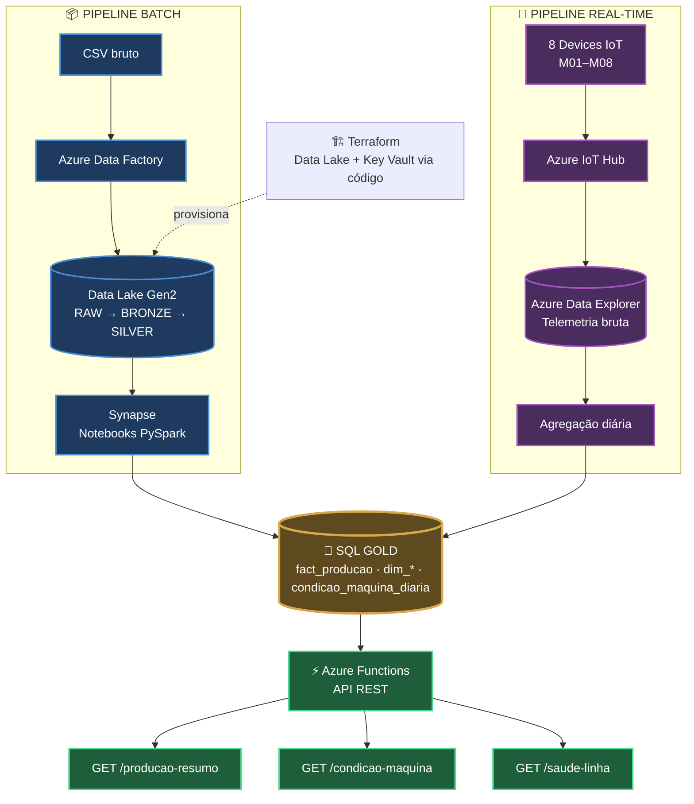

# Projeto Indústria 4.0 — Pipeline de Dados Azure

## 1. Problema

Fábricas que operam com processos manuais de produção têm dois pontos cegos: **dados históricos de produção espalhados e não padronizados**, e **nenhuma visibilidade em tempo real sobre a condição das máquinas** — o que atrasa decisões e esconde perdas (refugo alto, máquina superaquecendo) até ser tarde demais.

Este projeto simula uma fábrica inteligente (Indústria 4.0) que resolve os dois problemas com um único pipeline de dados na Azure: histórico de produção (CSV) é transformado num modelo dimensional consultável, telemetria de sensores (temperatura, vibração, RPM) é ingerida em tempo real, e ambos convergem numa API REST que serve indicadores de produção e saúde de máquina sob demanda.

Projeto de portfólio em Engenharia de Dados, com infraestrutura provisionada tanto manualmente quanto como código (Terraform).

---

## 2. Arquitetura



**Fluxo em uma frase:** dois pipelines independentes (batch e real-time) alimentam o mesmo modelo dimensional no SQL Server (camada Gold), que é exposto ao mundo externo por uma API REST serverless.

---

## 3. Stack técnico

| Camada | Tecnologias |
|---|---|
| Ingestão / Orquestração | Azure Data Factory, Azure IoT Hub |
| Armazenamento | Azure Data Lake Storage Gen2, Azure Data Explorer (Kusto/KQL) |
| Processamento | PySpark (Azure Synapse Spark Pool) |
| Banco relacional | Azure SQL Database (Serverless) |
| API | Azure Functions (Python), pymssql |
| Segurança | Azure Key Vault |
| Infraestrutura como Código | Terraform |
| Linguagens | Python, SQL, PySpark, HCL |

---

## 4. Implementação

### 4.1 Pipeline Batch — Raw → Bronze → Silver → Gold

Ingestão de dados históricos de produção (CSV), transformados progressivamente até um modelo dimensional consultável, seguindo a arquitetura medallion.

**Orquestração (Data Factory + Synapse):** o pipeline `pl_raw_to_bronze` copia os arquivos brutos para a Raw e dispara a primeira transformação; o Synapse orquestra internamente cada etapa (leitura, metadados, processamento por linha via ForEach, carga final via stored procedure).


**Armazenamento em camadas:** dados organizados fisicamente em três camadas dentro do container `inicial-datalake`.


**Transformação (PySpark no Synapse):** três notebooks sequenciais (`01_raw_to_bronze`, `02_bronze_to_silver`, `03_silver_to_gold`). Dimensões carregadas via overwrite simples; a tabela fato `gold.fact_producao` é atualizada via **upsert incremental**, usando a chave de negócio (`sk_linha + sk_maquina + sk_data`) para garantir que reprocessamentos atrasados não dupliquem registros.


**Resultado consultável:**


---

### 4.2 Pipeline Real-time — IoT Hub → Data Explorer → SQL

Telemetria simulada de sensores (temperatura, vibração, RPM) de 8 devices (M01–M03 → Linha 1, M04–M06 → Linha 2, M07–M08 → Linha 3), ingerida via IoT Hub, armazenada em série temporal no Data Explorer, e agregada diariamente no SQL Gold.


> O cluster Data Explorer cobra por compute mesmo ocioso — fica parado (Stopped) por padrão e só é ligado sob demanda (ver incidente de custo na seção 5).

---

### 4.3 API — Azure Functions

Azure Function App (`blueprint-azure`, Flex Consumption, Linux, Python 3.13) com 3 rotas HTTP consultando o SQL Gold via `pymssql`:

- `GET /api/producao-resumo?linha=L1` — resumo de produção por linha
- `GET /api/condicao-maquina?id_maquina=M01` — última leitura de condição de uma máquina
- `GET /api/saude-linha?linha=L1` — visão combinada produção + condição

Credenciais nunca em texto plano: lidas de variáveis de ambiente, com o código já preparado para referência direta ao Key Vault (`@Microsoft.KeyVault(SecretUri=...)`).

**As 3 rotas respondendo com dado real na nuvem:**


<details>
<summary><strong>🔧 Troubleshooting: 3 problemas reais resolvidos no caminho até a API funcionar (clique para expandir)</strong></summary>

**1. Portal sem opção de plano compatível.** O plano clássico Consumption (Linux) sumiu do formulário visual do portal, restando só "Flex Consumption" (bloqueado em conta Free Trial) e "Consumption (Windows)" (sem suporte a Python). Diagnosticado com `az functionapp create --debug`: erro de rede numa chamada que baixa um catálogo grande (`functionAppStacks`). Resolvido com upgrade da assinatura para Pay-As-You-Go, o que também destravou o Flex Consumption.

**2. Deploy publicando o projeto errado.** O workspace tinha duas pastas de function app (a real e uma de exemplo de aula). Mesmo com a pasta certa marcada como padrão na extensão do VS Code, o deploy insistia em publicar a errada. Causa raiz: `.vscode/settings.json` tem duas chaves distintas — `projectSubpath` (qual pasta o workspace reconhece) e `deploySubpath` (qual pasta é de fato publicada) — e a segunda estava presa no valor antigo:

```jsonc
// antes
"azureFunctions.deploySubpath": "api_function_project"
// depois
"azureFunctions.deploySubpath": "api_projeto_final"
```


**3. Erro 500 por variáveis de ambiente ausentes na nuvem.** Com o código certo publicado, as 3 rotas retornavam erro 500. O `SQL_USER`/`SQL_PASSWORD` não têm valor padrão no código (diferente de `SQL_SERVER`/`SQL_DATABASE`) e a Function App na nuvem não tinha essas variáveis cadastradas — só as de infraestrutura criadas automaticamente pelo Azure. Resolvido cadastrando as variáveis em **Function App → Settings → Environment variables**.

</details>

---

### 4.4 Infraestrutura como Código — Terraform

Módulo bônus: recriação via código de dois recursos que já existiam manualmente no projeto (Storage Account Data Lake Gen2 + Key Vault), provando o mesmo padrão de forma reprodutível e versionável. O Resource Group existente é apenas **referenciado** (`data`, não `resource`) — os recursos novos são criados ao lado, sem interferir no que já está lá.

**Ciclo completo testado: `init` → `plan` → `apply` → confirmação no Portal → `destroy`**


<details>
<summary><strong>🔧 Troubleshooting: 2 problemas de rede diagnosticados (clique para expandir)</strong></summary>

**1. Registro automático de Resource Providers travando em rede.** O provider `azurerm` tenta registrar automaticamente **todos** os Resource Providers que suporta (dezenas, incluindo vários que o projeto nem usa), e várias dessas chamadas falhavam com `connection may have been reset`. Resolvido com `skip_provider_registration = true` no bloco do provider, já que os providers realmente necessários (`Storage`, `KeyVault`) já estavam registrados.

**2. Instabilidade de rede em IPv6.** Mesmo após a correção acima, `terraform apply` seguia falhando de forma intermitente (leitura do Resource Group, `listKeys`, leitura do Key Vault) — sempre travando por minutos e caindo com conexão resetada. Os endereços na mensagem de erro eram IPv6. Corrigido desativando o protocolo IPv6 no adaptador de rede, forçando IPv4. Como efeito colateral, o Terraform detectou um recurso em estado "tainted" de uma tentativa anterior e o recriou automaticamente — comportamento correto e esperado da ferramenta.

</details>

```hcl
# main.tf — trecho principal
resource "azurerm_storage_account" "datalake" {
  name                     = "dltfianfava01"
  resource_group_name      = data.azurerm_resource_group.meu_rg.name
  location                 = data.azurerm_resource_group.meu_rg.location
  account_tier             = "Standard"
  account_replication_type = "LRS"
  is_hns_enabled           = true  # Data Lake Gen2
}

resource "azurerm_key_vault" "kv" {
  name                = "kv-tf-ianfava01"
  resource_group_name = data.azurerm_resource_group.meu_rg.name
  location            = data.azurerm_resource_group.meu_rg.location
  tenant_id           = data.azurerm_client_config.atual.tenant_id
  sku_name            = "standard"
}
```

---

## 5. Resultados, aprendizados e próximos passos

### Status atual

- ✅ Pipeline Batch completo e testado (Data Factory → Data Lake → Synapse → SQL Gold)
- ✅ Pipeline Real-time completo e testado (IoT Hub → Data Explorer → SQL Gold)
- ✅ API publicada na nuvem, 3 rotas respondendo com dado real
- ✅ Módulo Terraform completo (Data Lake + Key Vault via código, ciclo de vida testado)
- ⬜ Docker e CI/CD (GitHub Actions) — próximos módulos bônus planejados

### Lições aprendidas

- **Segurança de credenciais:** uma senha do SQL foi identificada em texto plano num notebook Synapse durante revisão pré-publicação. Corrigido com Azure Key Vault dedicado (`kv-curso-azure`) + linked service, usando `mssparkutils.credentials.getSecretWithLS(...)` para buscar a credencial em tempo de execução — nunca escrita em nenhum arquivo do repositório. Uma tentativa anterior com `getFullConnectionString()` foi descartada por limitação da função para linked services com campos separados. Como precaução, a senha exposta será trocada.
- **Gestão de custo:** um incidente real de ~R$170 foi causado pelo cluster Azure Data Explorer permanecendo em estado "Running" sem uso ativo por 2 dias. Lição aplicada desde então: monitoramento ativo de recursos de compute, com o cluster parado por padrão e ligado só sob demanda.
- **Separação de responsabilidades:** Storage Account dedicado (`stfuncindustria40`) para a Function App, isolado do Data Lake principal — decisão intencional de arquitetura, não acidente.

### Próximos passos

1. Containerização da API com Docker
2. Pipeline de CI/CD via GitHub Actions (deploy automatizado da API e dos notebooks Synapse)
3. Definição do formato final de apresentação do portfólio (README / LinkedIn / site pessoal)
